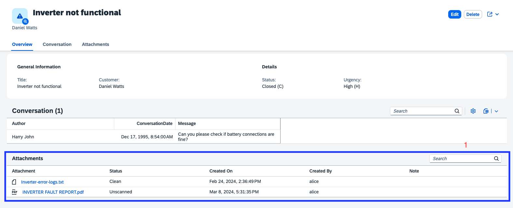
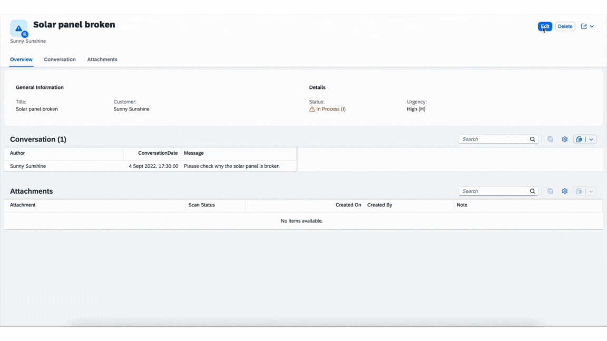
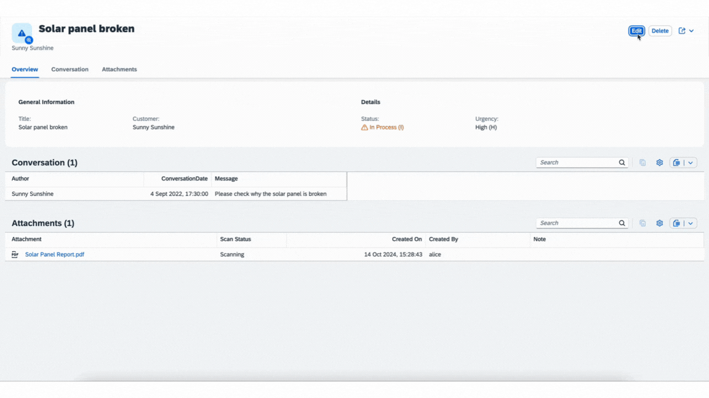

[](https://api.reuse.software/info/github.com/cap-js/attachments)

# Attachments Plugin

The `@cap-js/attachments` package is a [CDS plugin](https://cap.cloud.sap/docs/node.js/cds-plugins#cds-plugin-packages) that provides out-of-the box asset storage and handling by using an *aspect* `Attachments`. It also provides a CAP-level, easy to use integration of the SAP Object Store.

### Table of Contents

- [Setup](#setup)
- [Use `Attachments`](#use-attachments)
- [Test-drive Locally](#test-drive-locally)
- [Using SAP Object Store](#using-sap-object-store)
- [Contributing](#contributing)
- [Code of Conduct](#code-of-conduct)
- [Licensing](#licensing)


## Setup


To enable attachments, simply add this self-configuring plugin package to your project:

```sh
 npm add @cap-js/attachments
```

In this guide, we use the [Incidents Management reference sample app](https://github.com/cap-js/incidents-app) as the base application, to add `Attachments` type to the CDS model.

> [!Note]
> To be able to use the Fiori *uploadTable* feature, you must ensure ^1.121.0 SAPUI5 version is updated in the application's _index.html_


## Use Attachments 

To use Attachments, simply add an element referring to the pre-defined `Attachments` type as follows:

```cds
using { Attachments } from '@cap-js/attachments';

entity Incidents {
  // ...
  attachments: Composition of many Attachments;
}
```


## Test-drive Locally
With the steps above, we have successfully set up asset handling for our reference application. Let's see that in action.
We can try out the scenarios where the attachments contents are stored locally in the database.

1. **Start the server**:

  - *Default* scenario (In memory database):
      ```sh
      cds watch
      ```

2. **Navigate to the object page** of the incident `Solar panel broken`:

    Go to [Object page for incident **Solar panel broken**](http://localhost:4004/incidents/app/#/Incidents(ID=3583f982-d7df-4aad-ab26-301d4a157cd7,IsActiveEntity=true))

3. The `Attachments` type has generated an out-of-the-box Attachments table (see 1) at the bottom of the Object page:


4. **Upload a file** by going into Edit mode and either using the **Upload** button on the Attachments table or by drag/drop. Then click the **Save** button to have that file stored that file in the dedicated resource (database, S3 bucket, etc.). We demonstrate this by uploading the PDF file from [_xmpl/db/content/Solar Panel Report.pdf_](./xmpl/db/content/Solar%20Panel%20Report.pdf):


6. **Delete a file** by going into Edit mode and selecting the file(s) and by using the **Delete** button on the Attachments table. Then click the **Save** button to have that file deleted from the resource (database, S3 bucket, etc.). We demonstrate this by deleting the previously uploaded PDF file: `Solar Panel Report.pdf`



## Using SAP Object Store

For using SAP Object Store, you must already have a SAP Object Store service instance with a bucket which you can access. To connect it, follow this setup.

1. Log in to Cloud Foundry:

    ```sh
    cf login -a <CF-API> -o <ORG-NAME> -s <SPACE-NAME>
    ```

2.  To bind to the service continue with the steps below.

    In the project directory, you can generate a new file _.cdsrc-private.json by running:

    ```sh
    cds bind attachments -2 <INSTANCE>:<SERVICE-KEY> --kind s3
    ```


## Contributing

This project is open to feature requests/suggestions, bug reports etc. via [GitHub issues](https://github.com/cap-js/attachments/issues). Contribution and feedback are encouraged and always welcome. For more information about how to contribute, the project structure, as well as additional contribution information, see our [Contribution Guidelines](CONTRIBUTING.md).

## Code of Conduct

We as members, contributors, and leaders pledge to make participation in our community a harassment-free experience for everyone. By participating in this project, you agree to abide by its [Code of Conduct](CODE_OF_CONDUCT.md) at all times.

## Licensing

Copyright 2024 SAP SE or an SAP affiliate company and contributors. Please see our [LICENSE](LICENSE) for copyright and license information. Detailed information including third-party components and their licensing/copyright information is available [via the REUSE tool](https://api.reuse.software/info/github.com/cap-js/attachmentstea).
