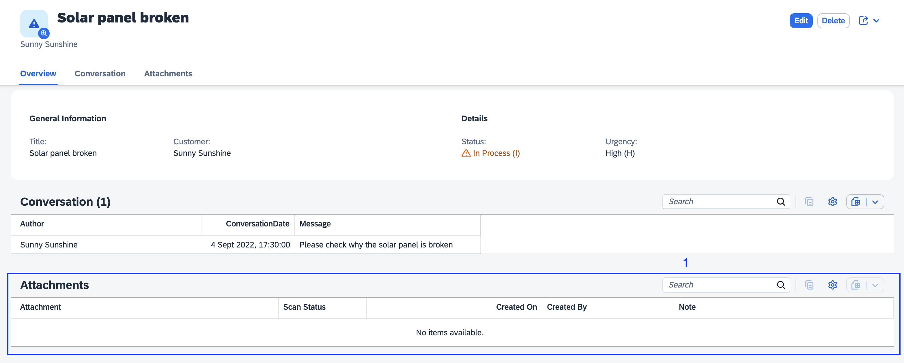

[](https://api.reuse.software/info/github.com/cap-js/attachments)

# Attachments Plugin

The `@cap-js/attachments` package is a [CDS plugin](https://cap.cloud.sap/docs/node.js/cds-plugins#cds-plugin-packages) that provides out-of-the box asset storage and handling by using an *aspect* `Attachments`. It also provides a CAP-level, easy to use integration of the SAP Object Store.

### Table of Contents

- [Setup](#setup)
- [Use `Attachments`](#use-attachments)
- [Test-drive Locally](#test-drive-locally)
- [Using SAP Object Store](#using-sap-object-store)
- [Using SAP Malware Scanning service](#using-sap-malware-scanning-service)
- [Multitenancy](#multi-tenancy)
- [Contributing](#contributing)
- [Code of Conduct](#code-of-conduct)
- [Licensing](#licensing)


## Setup


To enable attachments, simply add this self-configuring plugin package to your project:

```sh
 npm add @cap-js/attachments
```

In this guide, we use the [Incidents Management reference sample app](https://github.com/cap-js/incidents-app) as the base application, to add `Attachments` type to the CDS model.

> [!Note]
> To be able to use the Fiori *uploadTable* feature, you must ensure 1.121.0/ 1.122.0/ ^1.125.0 SAPUI5 version is updated in the application's _index.html_


## Use Attachments

> [!Note]
> To be able to use the plugin with Fiori elements UI, make sure *draft* is enabled for the entity.

> The plugin currently supports file uploads up to **400 MB** in size per attachment.

To use Attachments, simply add an element referring to the pre-defined `Attachments` type as follows:

```cds
using { Attachments } from '@cap-js/attachments';

entity Incidents {
  // ...
  attachments: Composition of many Attachments;
}
```


## Test-drive Locally
With the steps above, we have successfully set up asset handling for our reference application. Let's see that in action.
We can try out the scenarios where the attachments contents are stored locally in the database.

1. **Start the server**:

  - *Default* scenario (In memory database):
      ```sh
      cds watch
      ```

2. **Navigate to the object page** of the incident `Solar panel broken`:

    Go to [Object page for incident **Solar panel broken**](http://localhost:4004/incidents/app/#/Incidents(ID=3583f982-d7df-4aad-ab26-301d4a157cd7,IsActiveEntity=true))

3. The `Attachments` type has generated an out-of-the-box Attachments table (see 1) at the bottom of the Object page:


4. **Upload a file** by going into Edit mode and either using the **Upload** button on the Attachments table or by drag/drop. Then click the **Save** button to have that file stored that file in the dedicated resource (database, S3 bucket, etc.). We demonstrate this by uploading the PDF file from [_xmpl/db/content/Solar Panel Report.pdf_](./xmpl/db/content/Solar%20Panel%20Report.pdf):


6. **Delete a file** by going into Edit mode and selecting the file(s) and by using the **Delete** button on the Attachments table. Then click the **Save** button to have that file deleted from the resource (database, S3 bucket, etc.). We demonstrate this by deleting the previously uploaded PDF file: `Solar Panel Report.pdf`


## Using SAP Object Store

For using SAP Object Store, you must already have a SAP Object Store service instance with a bucket which you can access. To connect it, follow this setup.

1. Log in to Cloud Foundry:

    ```sh
    cf login -a <CF-API> -o <ORG-NAME> -s <SPACE-NAME>
    ```

2.  To bind to the service continue with the steps below.

    In the project directory, you can generate a new file _.cdsrc-private.json by running:

    ```sh
    cds bind objectstore -2 <INSTANCE>:<SERVICE-KEY> --kind s3
    ```

## Using SAP Malware Scanning Service

For using [SAP Malware Scanning Service](https://discovery-center.cloud.sap/serviceCatalog/malware-scanning-service), you must already have a service instance which you can access.

1.  To bind to the service continue with the steps below.

    ```sh
    cds bind malware-scanner -2 <INSTANCE>:<SERVICE-KEY>
    ```

By default, malware scanning is enabled for all profiles except development profile. You can configure malware scanning by setting:

```json
"attachments": {
    "scan": true
}
```


## Visibility control for Attachments UI Facet generation

By setting the `@attachments.disable_facet` property to `true`, developers can hide the plugin from the UI achieving visibility.
This feature is particularly useful in scenarios where the visibility of the plugin needs to be dynamically controlled based on certain conditions.

### Example Usage

```cds
entity Incidents {
  // ...
  @attachments.disable_facet
  attachments: Composition of many Attachments;
}
```
In this example, the `@attachments.disable_facet` is set to `true`, which means the plugin will be hidden by default.

## Non-Draft Upload Example

For scenarios where the entity is not draft-enabled, see [`tests/non-draft-request.http`](./tests/non-draft-request.http) for sample `.http` requests to perform metadata creation and content upload.

The typical sequence includes:

1. **POST** to create attachment metadata  
2. **PUT** to upload file content using the ID returned

> This is useful for non-draft-enabled entity sets. Make sure to replace `{{host}}`, `{{auth}}`, and IDs accordingly.

## Multitenancy

The plugin supports multitenancy scenarios, allowing both shared and tenant-specific object store instances.

> [!Note]
> Starting from version 2.1.0, **separate mode** for object store instances is the default setting for multitenancy.  
> As of version 2.2.0, both the `standard` and `S3-standard` plans of the SAP Object Store offering are supported.  
> **Important:** The `S3-standard` plan is no longer available for new subscriptions. For new object store instances, use the `standard` plan.

For multitenant applications, make sure to include `@cap-js/attachments` in the dependencies of both the application-level and mtx/sidecar package.json files.

### Shared Object Store Instance

> [!Note]
> Ensure the shared object store instance is bound to the `mtx` application module before deployment.

To configure a shared object store instance, modify both the package.json files as follows:

```json
"cds": {
    "requires": {
        "attachments": {
            "objectStore": {
                "kind": "shared"
            }
        }
    }
}
```
To ensure tenant identification when using a shared object store instance, the plugin prefixes attachment URLs with the tenant ID. 

## Contributing

This project is open to feature requests/suggestions, bug reports etc. via [GitHub issues](https://github.com/cap-js/attachments/issues). Contribution and feedback are encouraged and always welcome. For more information about how to contribute, the project structure, as well as additional contribution information, see our [Contribution Guidelines](CONTRIBUTING.md).

## Code of Conduct

We as members, contributors, and leaders pledge to make participation in our community a harassment-free experience for everyone. By participating in this project, you agree to abide by its [Code of Conduct](CODE_OF_CONDUCT.md) at all times.

## Licensing

Copyright 2024 SAP SE or an SAP affiliate company and contributors. Please see our [LICENSE](LICENSE) for copyright and license information. Detailed information including third-party components and their licensing/copyright information is available [via the REUSE tool](https://api.reuse.software/info/github.com/cap-js/attachmentstea).
